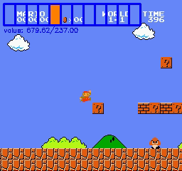
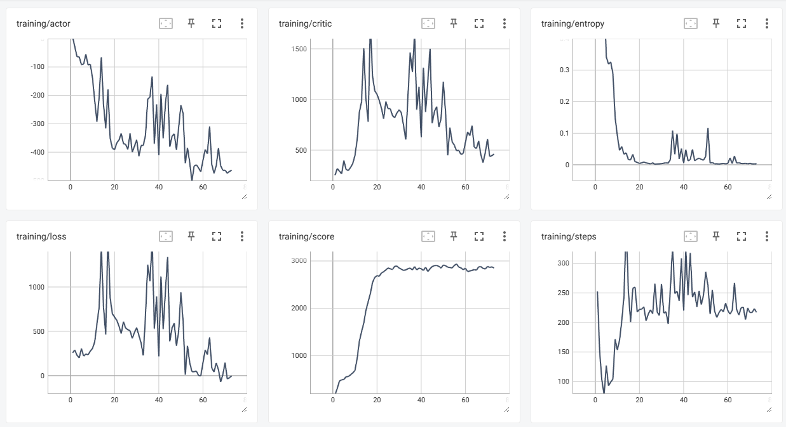

This is an application of PPO algorithm on the game Super Mario.

[](https://player.bilibili.com/player.html?aid=112804312974929)

## Prerequisites
```bash
 pip install -r requirements.txt
```
## Training
```bash
python trainer.py
```
To train with CPU
```bash
python trainer.py --device cpu
```
You may find the AI playback videos in the following folder

```bash
cd checkpoints/[game-name]/video
```

## Switching a game
Find the following code snippet in trainer.py, change the parameters as you wish.
```python
ppo = PPO(games.create_mario_profile, dict(world=1, stage=1), 8, 4)
```

## Training curve

